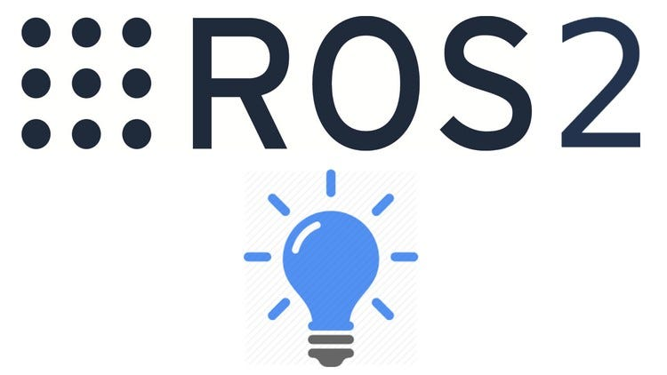

<table>
  <tr>
    <td>
      <h1>Laboratorio No. 03 - Robótica de Desarrollo</h1>
      <h2> Intro a ROS </h2>
      <strong> Autores:</strong>
      <ul>
        <li>Daniel Mauricio Rivero Lozada </li>
        <li>Yeira Liseth Rodríguez Rodríguez</li>
      </ul>
    </td>
    <td>
      
    </td>
  </tr>
</table>

## Resumen de los pasos principales de proceso de instalación de Ros2

Resumen de los pasos principales para instalar ROS2 usando RoboStack con Conda/Mamba

<b> Descargar e instalar Miniforge: </b> Antes de instalar ROS2 con RoboStack, es necesario configurar un entorno con Conda o Mamba. Se recomienda usar Miniforge, una versión ligera de Conda que facilita la instalación y administración de paquetes.

<b> Instalación Mamba: </b> Mamba es una alternativa a Conda que acelera la instalación y resolución de dependencias.

<b> Creación del Entorno ROS: </b> Crear y activar un entorno para ROS. Agregar los canales de paquetes necesarios

<b>  Instalación de ROS2: </b> Instalar la versión deseada de ROS2 (por ejemplo, Humble) y reactivar el entorno para inicializar ROS

<b>  Instalación herramientas de desarrollo: </b> Instalar las herramientas eseciales. Si se desea hacer código en Python o c++ y se tiene Windows, se debe que descargar VisualStudio Community 2022. Una vez en el instalador irse a la opción de Herramientas de desarrollo de C++ y solos dejar las opciones de 

* WINDOWS SDK
* Command Tools

Como se muestra a continuación

  

<b> *Prueba de instalación: </b> Se puede ejecutar RViz en ROS2 para comprobar la instalación

### Procedimiento utilizado

Robostack

### Sistema operativo utilizado

Windows

## Dificultades de instalación o de arranques principales

Al crear el entorno para ROS2 con Mamba, no se tenía Conda instalado dentro del entorno. Esto se debe a que, por defecto, Conda y Mamba solo están disponibles en el entorno base y no se heredan en los entornos creados.

